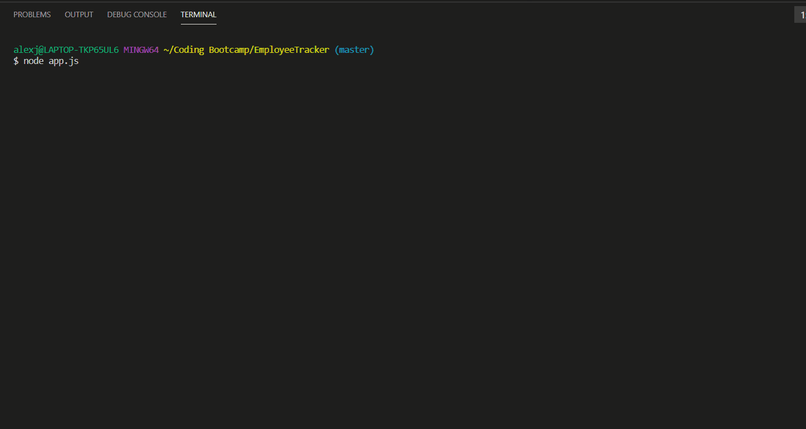
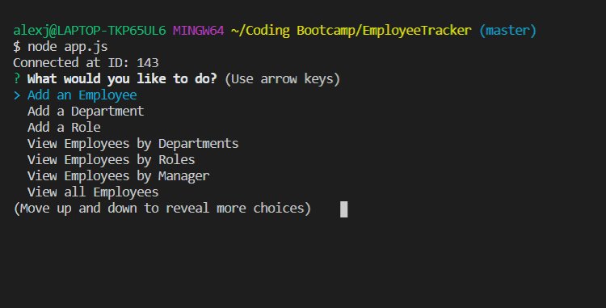
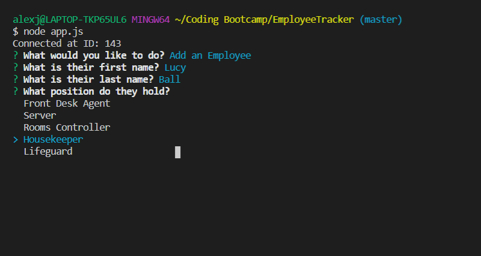
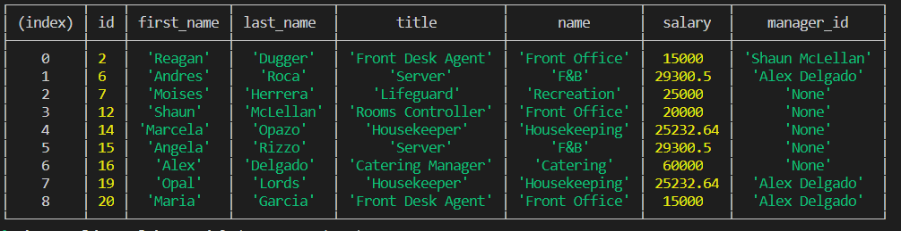

# EmployeeTracker
This application will serve as a CMS for employees.

## Description
The application can add departments, roles, and new employees to the existing database. The user can also see existing data through different parameters.

### Table of Contents
I. Title
II. Description
III. Table of Contents
IV. Installation
V. Visuals
VI. Usage
VII. License
VIII. Contributing
IX. Test(s)
X. Questions
    
## Installation
The user will need to install inquirer, console.table, and mysql as dependencies for this application.

## Visuals

GIF
 

IMAGES
 

## Usage
The project connects to the localhost to access a mysql database. There is a schema file that shows how to set up the "employees_db" database, as well as a seed file for testing the application. Following the CRUD model, the user can add, view, update and delete either employees, roles, or departments of a company. The user also has the ability to see employees of a certain department or role as well as see the whole budget of a specific department.

## License

    
## Contributing
N/A

## Test(s)
N/A

## Questions
If you have any questions, please feel free to contact me below.

Email: alexjoeldelgado@gmail.com

<a href='https://github.com/alexjoeldelgado'>Github Profile: alexjoeldelgado</a>

